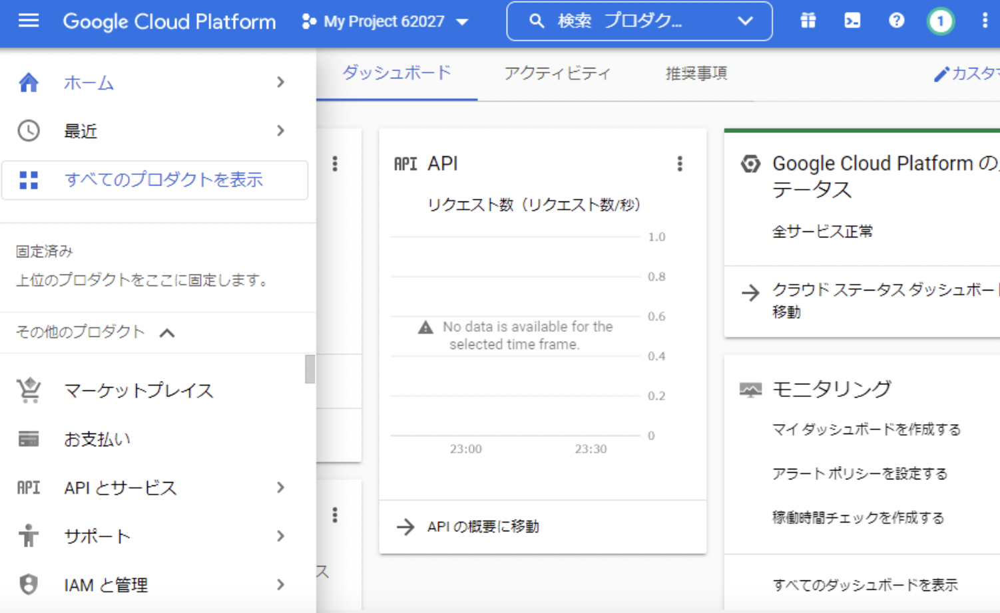

このリポジトリには、Googleのカスタム検索エンジンを使用して特定のキーワードで検索し、  
結果をWordドキュメントに保存し、Googleドライブにアップロードするpythonスクリプトです。

  
Step.1: google custom search engine APIを有効にし、APIkeyとIDを設定する。

 ブラウザで[google cloud plat form](https://cloud.google.com/free?utm_source=google&utm_medium=cpc&utm_campaign=japac-JP-all-ja-dr-BKWS-all-core-trial-EXA-dr-1605216&utm_content=text-ad-none-none-DEV_c-CRE_602341359562-ADGP_Hybrid%20%7C%20BKWS%20-%20EXA%20%7C%20Txt%20~%20GCP%20~%20General_core%20brand-KWID_43700071566406792-aud-1644542956268%3Akwd-26415313501&userloc_1009365-network_g&utm_term=KW_google%20cloud%20platform&gclid=CjwKCAjwov6hBhBsEiwAvrvN6Eqgy3VztdEsdwjtgHS7rL05V0zvy0K7Iuv90bsXry1e3w71hwhlBhoCO_oQAvD_BwE&gclsrc=aw.ds)のダッシュボードページを開きます。  
 
 

 ヘッダーにある表示中のプロジェクト（プルダウンメニュー）をクリックします。
 
 
  

google custom search APIを有効化する 

APIkeyを作成する　ここで作成したkeyをpythonコードのyour keyに貼り付けます

プログラム可能な検索エンジンページにアクセスします。

https://programmablesearchengine.google.com/controlpanel/all

ここで取得したIDをpythonコードに添付します。

下記のnotbookボタンからcoogle colabo notbookを開きます。

ノートブックをgoogle driveにコピーします。（いつでもgoogledriveから使うことができるようになる）

最初のコードを実行し、googleドライブとの接続を許可します。（これは毎回行う必要がある）

先ほど作成したapikeyとidをコードに添付します。

出力データを保存したいgoogleドライブのフォルダのIDをコードに添付します。  
googleドライブのフォルダに移動し、URLをコピー（このURLが保存先のIDになります）

コピーしたIDを下記の箇所に添付します。

順番に実行してフォルダに出力結果が保存されていることを確認してください。　　

エラーが出た時はそのエラーをchatgptに添付して、修正コードや必要なモジュールを指示にしたがいインストールしてください。

